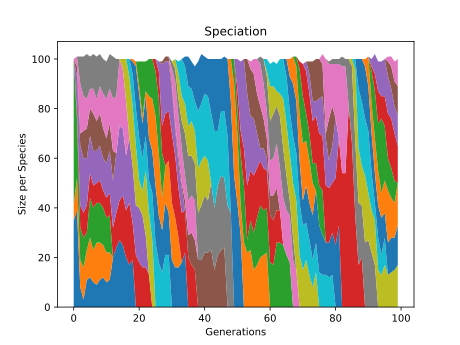

<!-- PROJECT LOGO -->
<br />
<div align="center">

<h1 align="center">NEAT-retro-frogger</h3>

  <p align="center">
    Train a <a href="https://neat-python.readthedocs.io/en/latest/">NEAT</a> genetic algorithm to play Frogger using OpenAI <a href="https://github.com/openai/retro">retro-gym</a>
    <br />
    <a href="https://github.com/rdarneal/neat-retro-frogger/issues">Report Bug</a>
  </p>
</div>


<!-- TABLE OF CONTENTS -->
<details>
  <summary>Table of Contents</summary>
  <ol>
    <li>
      <a href="#about-the-project">About The Project</a>
    </li>
    <li>
      <a href="#getting-started">Getting Started</a>
      <ul>
        <li><a href="#prerequisites">Prerequisites</a></li>
        <li><a href="#installation">Installation</a></li>
      </ul>
    </li>
    <li><a href="#usage">Usage</a></li>
    <li><a href="#contributing">Contributing</a></li>
    <li><a href="#contact">Contact</a></li>
    <li><a href="#acknowledgments">Acknowledgments</a></li>
  </ol>
</details>


<!-- ABOUT THE PROJECT -->
## About The Project


This project utilizes the python implementation of [NEAT](https://en.wikipedia.org/wiki/Neuroevolution_of_augmenting_topologies) to play Sega Genesis Frogger. 

An evolving artificial neural network attempts to simultanesouly learn weight values and the structure of the neural network that will perform best (via 'rewards' tracked in retro-gym).

<p align="right">(<a href="#readme-top">back to top</a>)</p>

<!-- GETTING STARTED -->
## Getting Started
### From scratch
On Windows,  ensure you install [conda](https://docs.conda.io/en/latest/miniconda.html#windows-installers) and [git](https://git-scm.com/download/win)

### Prerequisites

The recommended installation method is described below, but if you prefer to install via `pip` then ensure you have the following packages installed
  ```sh
  pip install gym-retro==0.21 matplotlib neat-python opencv-python numpy
  ```
Note: During development gym==0.21 was used due to compatibility issues


### Installation

1. Clone the repo
   ```sh
   git clone https://github.com/rdarneal/neat-retro-frogger.git
   ```
2. Navigate to cloned directory
   ```sh
   cd neat-retro-frogger
   ```
3. Install conda environment
   ```sh
   conda env create -n retro-env --file environment.yml
   ```
4. Actiate the environment
   ```sh
   conda activate retro-env
   ```
5. Load the ROM(s) using gym-retro
   ```python
   python -m retro.import /path/to/your/ROMs/directory
   ```

Note: This repo does not contain the ROM file for Frogger-Genesis. Check the [No-Intro Collection on Archive.org](https://archive.org/details/No-Intro-Collection_2016-01-03_Fixed) for ROMs.

<p align="right">(<a href="#readme-top">back to top</a>)</p>


<!-- USAGE EXAMPLES -->
## Usage

To jump right to training
```python 
python app/parallel-runner.py
```
This will launch into training via natural selection. The script will run until an individual meets the fitness threshold 5,000 points OR 100 generations of Frogger, whichever is sooner.

If you want to see the results, run:
```python
python app/playback-winner.py
```
Which shows how species performed over multiple generations

Fig 1. Species Lifetime


Along with the average fitness over time, determined by the retro-gym reward function (in this case tied to how well frogger crosses traffic)

Fig 2. Fitness


## To configure or modify
By default, each generation includes a population of 100, and random values are passed to the retro-environment in order to control frogger.

Each generation is then divded into 'species', or groups of individuals with similar performance, and a new generation is created.

The `.config` file specifies the parameters used in training the network - which includes how long species survive `stagnation`, , check out the neat-python [documentation](https://neat-python.readthedocs.io/en/latest/config_file.html) for additional details on what these parameters do.

You can train a new Frogger model using the `parallel-runner.py` script, you can play with the following parameters:
- In the `__main__` script:
  - `num_workers`, a keyword argument of `neat.ParallelEvaluator()` can be scaled to the number of CPU cores you would like to use for parallel training.
  - `n` keyword argument in the `p.run()` method defines the number of generations that will be used unless the fitness condition is met.

## Modifying to work with other ROMs
If you want to modify this for other games:
- Each python script needs to be modified to match the retro environment to the game you want to use
- You will need to download and use retro to load the ROM
- The config file is currently setup for Sega Genesis
  - Modify `num_inputs` to match the screen size of console
  - Modify `num_outputs` to 12, which should match # of buttons
  - Modify the python scripts to refactor use of buttons

<p align="right">(<a href="#readme-top">back to top</a>)</p>

<!-- CONTACT -->
## Contact

Robert Darneal - python-dev@robertdarneal.com

Project Link: [https://github.com/rdarneal/neat-retro-frogger](https://github.com/rdarneal/neat-retro-frogger)

<p align="right">(<a href="#readme-top">back to top</a>)</p>
